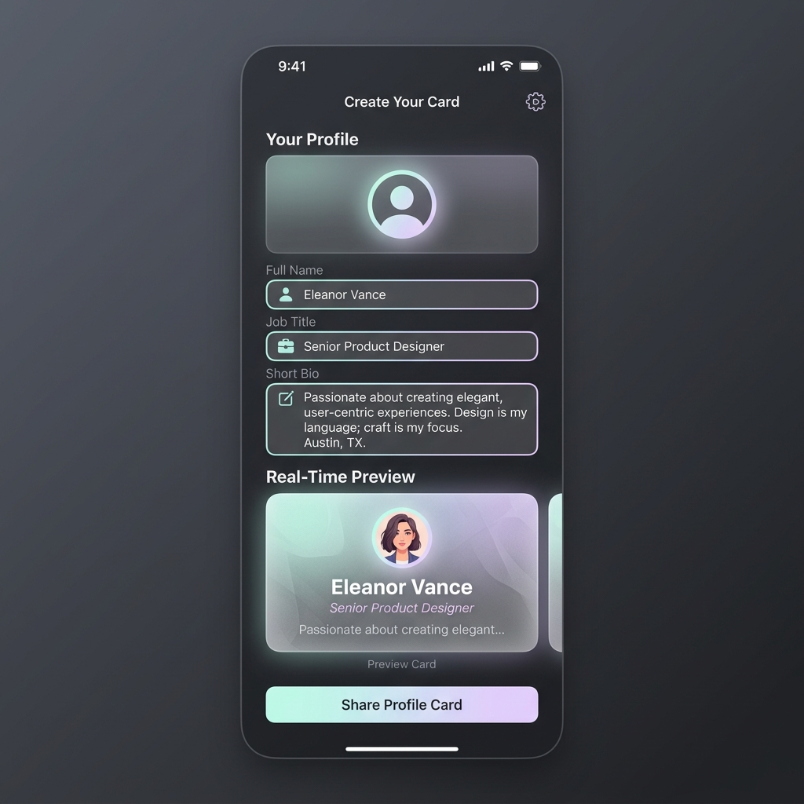
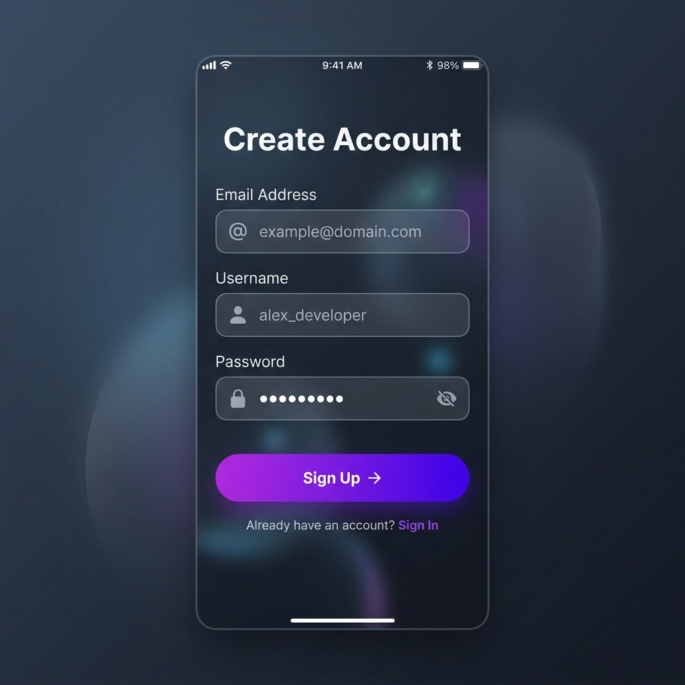
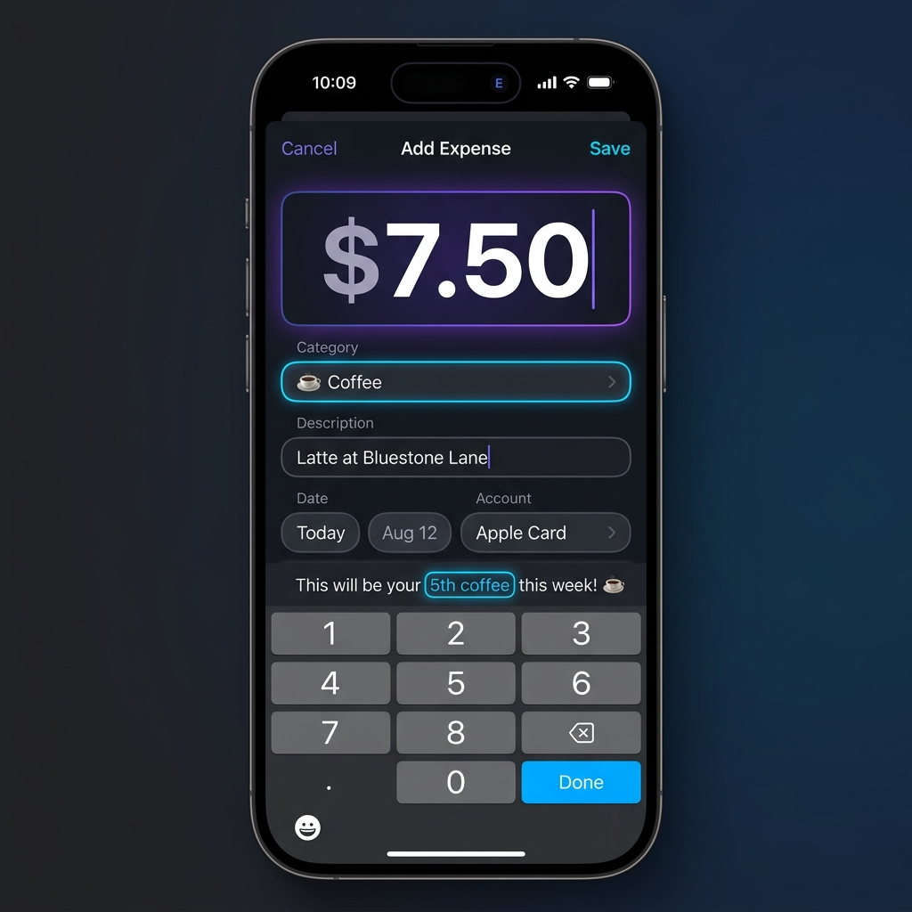
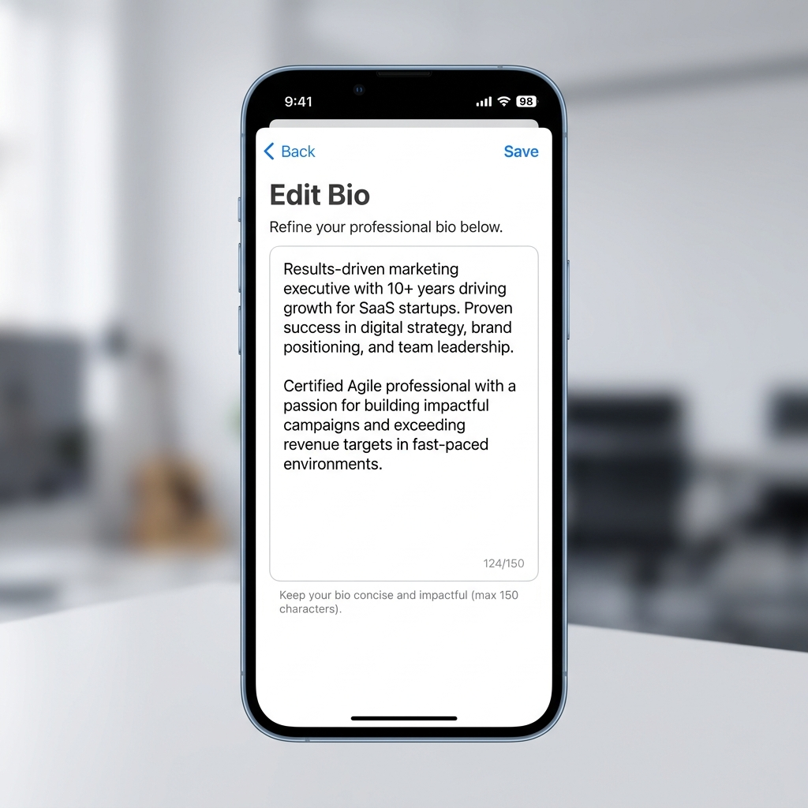
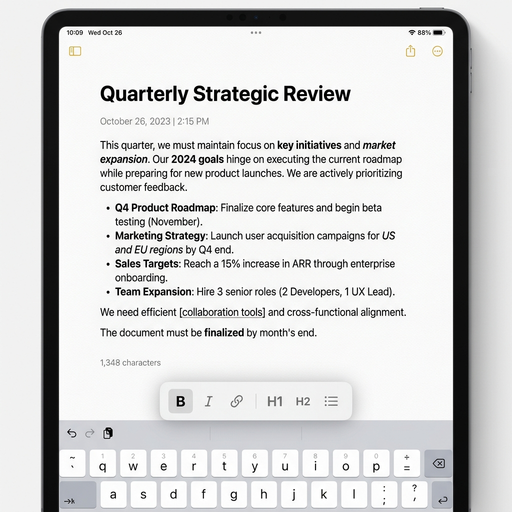

# SwiftUI Text & TextField Practice Projects

I have designed these projects to help you master `Text` and `TextField`. These range from absolute basics to complex interactive editors.

## ⚪️ Very Basic: Hello World Personalizer
**The Challenge:** Create a simple screen with a `TextField` and a `Text` view. As you type in the text field, the text view should update to say "Hello, [Your Name]!".

### Key Knowledge Areas:
- Creating a `@State` variable for the name.
- Using `TextField` with a placeholder.
- Displaying the variable inside a `Text` view using string interpolation (`"\(name)"`).
- Basic `.padding()` to make it look clean.

### Real Use Case:
The initial "Welcome" or "Set Up Your Name" screen in a new app.

---

## 🟢 Beginner: Profile Card Studio
**The Challenge:** Build a screen where users can enter their details to create a beautiful, live-previewing profile card.

### Key Knowledge Areas:
- `Text` modifiers: `.font()`, `.fontWeight()`, `.foregroundColor()`, `.italic()`.
- `TextField` basics: Binding to `@State` strings, placeholder text.
- Layout: Using `VStack` to stack inputs and the preview card.

### Real Use Case:
The "Edit Profile" screen found in almost every social media or networking app (like LinkedIn or Instagram).

---

## 🔵 Beginner-Intermediate: Secure Account Creator
**The Challenge:** Build a sign-up screen that focuses on security and smooth user experience.

### Key Knowledge Areas:
- `SecureField`: Masking sensitive input for passwords.
- `.textInputAutocapitalization(.never)`: Ensuring emails and passwords don't start with capitals.
- `.autocorrectionDisabled()`: Stopping the system from suggesting fixes for usernames/passwords.
- `.submitLabel(.next)` and `.submitLabel(.done)`: Changing the keyboard's "Return" button.
- `.onSubmit`: Automatically moving focus to the next field when "Return" is pressed.

### Real Use Case:
Any app's Sign-Up or Login flow (Netflix, Airbnb, etc.).

---

## 🟡 Intermediate: Smart Expense Logger
**The Challenge:** Create a financial input screen that handles currency and offers real-time feedback.

### Key Knowledge Areas:
- `TextField` formatters: Using `format: .currency(code: "USD")`.
- Keyboard types: `.keyboardType(.decimalPad)`.
- Input Validation: Show a `Text` error message if the amount exceeds a certain limit.
- `TextField` Axis: Use `axis: .vertical` for a multi-line "Notes" section.

### Real Use Case:
A budgeting app entry screen (like Mint or PocketGuard) that needs to ensure data is entered correctly and formatted as money.

---

## 🟠 Intermediate-Advanced: Professional Bio Editor
**The Challenge:** Build a sleek editor for a professional "About Me" section with strict constraints.

### Key Knowledge Areas:
- `.textSelection(.enabled)`: Allowing users to easily select and copy text.
- Character Limits: Using `.onChange` to prevent the user from typing more than 150 characters.
- Word Count: Dynamically updating a "Remaining Characters" counter.
- `.lineLimit(3...5)`: Controlling how many lines the text field expands to.

### Real Use Case:
Twitter's bio editor or a LinkedIn "Headline" edit screen.

---

## 🔴 Advanced: Markdown-lite Notes Editor
**The Challenge:** Build a high-end text editor that feels like a professional productivity tool.

### Key Knowledge Areas:
- `Text` Interpolation: Combining multiple `Text` views with different styles (e.g., `Text("Bold").bold() + Text(" Normal")`).
- Custom Styling: Removing the default `TextField` border and creating a custom underline or glassmorphic background.
- Focus State: Using `@FocusState` to automatically open the keyboard when the screen appears.
- Advanced Callbacks: Using `.onChange(of: myText)` to update a character count or perform "auto-save" logic.

### Real Use Case:
A distraction-free writing environment or a task manager (like Apple Notes, Notion, or Bear).

---

## Visual Inspiration
Use these generated designs as your goal for the UI:

